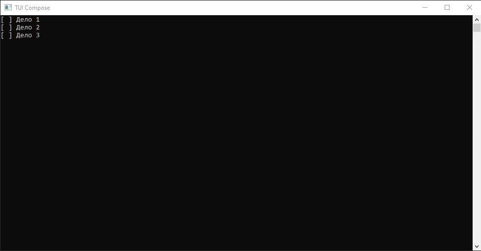

# TUI Compose
[](https://opensource.org/licenses/MIT)
[](https://github.com/romanSPB15/tui-compose/releases)
[](https://pkg.go.dev/github.com/romanSPB15/tui-compose/v2)
[](https://github-com.translate.goog/romanSPB15/tui-compose?_x_tr_sl=ru&_x_tr_tl=en&_x_tr_hl=ru&_x_tr_pto=wapp)  


Легковесный фреймворк для удобной разработки TUI-интерфейсов на Go с простым API, готовыми виджетами и встроенной поддержкой асинхронного обновления UI.

## Быстрый старт
```go
package main

import "github.com/romanSPB15/tui-compose/v3"

func main() {
    wnd := tui.NewWindow()
    wnd.SetTitle("Моё приложение")

    label := tui.NewStaticLabel("Привет, TUI!").ColorizeForeground(tui.Cyan)

    btn := tui.NewButton("Выход", func() {
        wnd.Quit()
    })

    box := tui.NewVBox(label, btn)
    wnd.SetContent(box)

    wnd.Run()
}
```

## Готовые виджеты

| Виджет          | Описание                                                    |
|-----------------|-------------------------------------------------------------|
| `Label`         | Текстовая метка                                             |
| `Button`        | Кнопка с обработчиком нажатия                               |
| `Check`         | Чекбокс                                                     |
| `TextEntry`     | Текстовое поле ввода                                        |
| `ColorProgress` | Прогресс бар из цветных блоков                              |
| `TextProgress`  | Прогресс бар из любых символов                              |
| `Canvas`        | Холст с 16-цветной псевдографикой                           |
| `CanvasRGB`     | Холст с RGB-псевдографикой(требуется терминал с True Color) |


## Установка
```
go get -u github.com/romanSPB15/tui-compose/v3
```