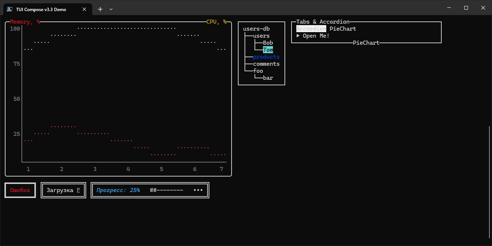

# TUI Compose
[](https://opensource.org/licenses/MIT)
[](https://github.com/romanSPB15/tui-compose/releases)
[](https://github.com/romanSPB15/tui-compose/actions/workflows/test.yaml)
[](https://github.com/romanSPB15/tui-compose/wiki)

[](https://github.com/romanSPB15/tui-compose/tree/main/examples)

* 🍬 9 готовых виджетов — Label, Button, InputField, Canvas, Frame и другие
* 👓 Diff-рендер, low-allocation — без мерцаний и аллокаций
* ✨ Автоматическое фокус по Tab/Shift+Tab
* 💎 Минимальный размер: ~4600 строк кода, только x/sys + x/term
* 🎁 Полная поддержка Windows — без WSL
* 🛠 Детекция data race при вызове методов окна — `-tags debug`
* 🎨 Удобная кастомизация через битовые маски Style — быстро и удобно
* 🔧 Кастомные виджеты — 3-6 методов(зависит от функцонала)
* 🛒 Контейнеры — не нужно считать координаты вручную

<p align="center">
<table>
<tbody>
</tbody>
</table>
</p>
<h3  align="center"><pre>go get -u github.com/romanSPB15/tui-compose/v3</pre></h3>
<p align="center">
<table>
<tbody>
</tbody>
</table>
</p>

## Быстрый старт
```go
package main

import (
	"strconv"

	"github.com/romanSPB15/tui-compose/v3"
)

func main() {
	wnd := tui.NewWindow()
	wnd.SetTitle("Моё приложение")

	label := tui.NewStaticLabel("Привет, TUI!").WithStyle(tui.FrCyan)

	btnQuit := tui.NewButton("Выход", func() {
		wnd.Quit()
	})

	v := 0

	btnAdd := tui.NewButton("+", func() {
		v++
		label.SetText(strconv.Itoa(v))
		wnd.Redraw()
	}).WithStyle(tui.BgRed)

	btnSub := tui.NewButton("-", func() {
		if v > 0 {
			v--
			label.SetText(strconv.Itoa(v))
			wnd.Redraw()
		}
	}).WithStyle(tui.BgBlue)

	box := tui.NewVBox(label, tui.NewHBox(btnAdd, btnSub), btnQuit)
	wnd.SetContent(box)

	wnd.Run()
}
```

## Готовые виджеты

| Виджет          | Описание                                                    |
|-----------------|-------------------------------------------------------------|
| `Label`         | Текстовая метка                                             |
| `Button`        | Кнопка с обработчиком нажатия                               |
| `Check`         | Чекбокс                                                     |
| `InputField`    | Текстовое поле ввода                                        |
| `ColorProgress` | Прогресс бар из цветных блоков                              |
| `TextProgress`  | Прогресс бар из любых символов                              |
| `Canvas`        | Холст с 16-цветными пикселями                               |
| `CanvasRGB`     | Холст с RGB-пикселями                                       |
| `Frame`         | Контейнер, который оборачивает содержимое в рамку           |

## Лицензия
[**MIT**](https://github.com/romanSPB15/tui-compose/blob/main/LICENSE)
